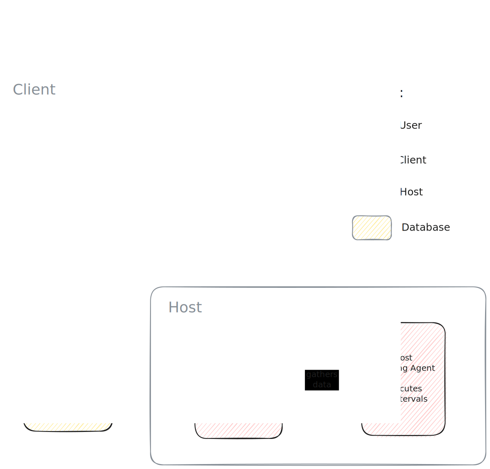
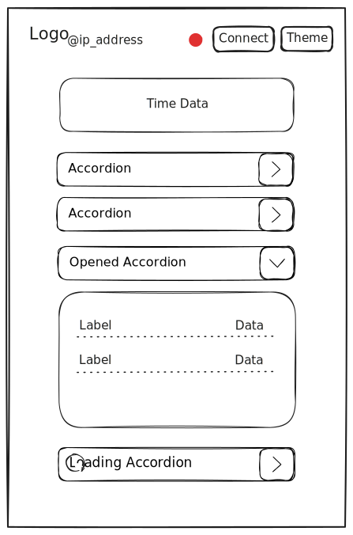

# Design

**Student Name:** Aleksandar Rangelov
**Student Number:** 572601

## Table of Contents

[TOC]

## 1. System Architecture

Sysmon follows a client-server architecture with real-time communication through WebSocket protocol. The system is divided into two independent services that communicate over the network.

**Architecture:** Client-Server with Pub-Sub messaging

**Components:**

- **Host:** 
  - System metrics data collection
  - WebSocket server

- **Client:** 
  - HTTP server (static pages, api endpoints)
  - Web Dashboard

This diagram provides a high level overview of the architecture of project


In short, user decides he wants to check up on the status of his device remotely, opens the web dashboard, connects to said device using the user interface and inspects rendered metrics. 

### 1.2 Components

Here, the same architecture is showcased in more depth.



Each component and their synergy will be explained next.

Host and Client separation allows for independent scaling and deployment for both services.

#### 1.2.1 Host

##### 1.2.1.1 WebSocket Server

> Establishes WebSocket connection with the web client.

**Key Functions:**

- WebSocket connection management (open, close, message handling)
- Handles Pub-Sub actions
- Controls periodic data collection

**Data Collection:**

- Static data collected once on initialization and cached for fast responses
- Dynamic data collected every on intervals when there is a connection
- All connections receive the same data at the same time, thanks to Pub-Sub. 

##### 1.2.1.2 Scraping Agent

> Library of functions, utilizing the systeminformation library, collecting system metrics into a semantic JSON object, ready to be sent over the network.

**Key Functions:**

- Data separation, based on frequency

#### 1.2.2 Client

##### 1.2.2.1 HTTP Server

> HTTP server used for serving HTML, CSS and JS files and handling of API routes

**Key Functions:**

- HTML, CSS, JavaScript delivery
- API route handling

##### 1.2.2.2 Web Dashboard

> Static HTML file with according CSS and JavaScript files linked to it. Renders system metrics, initializes and maintains WebSocket connection with corresponding host machine server.

**Key Functions:**

- WebSocket connection initialization and reconnection
- Holds DOM element references for fast updates of newly received data.
- Static data rendering - once when connected
- Dynamic data rendering - continuous updates
- Dark and light theme support
- Loading screen

Vanilla JavaScript is chosen over frontend frameworks in order to minimize payload size and eliminate build complexity. Direct DOM manipulation provides enough performance for this project.

## 2. Data Model

Static and dynamic data are separated to optimize collection frequency. Static data collected once and buffered in memory, while dynamic data continuously updated. This separation reduces unnecessary system calls and improves performance.

### 2.1 Static Data

> Data that changes rarely during runtime (i.e. immutable).

- System hardware specifications
- BIOS information
- Operating system details
- CPU specifications
- Total memory capacity
- Disk layouts

### 2.2 Dynamic Domain

> Data that is supposed to change frequently (i.e. mutable)

- Current time and uptime
- Active users
- CPU usage, temperature, and speed
- Used memory
- Battery status
- Process list with resource usage
- Disk I/O statistics
- Network interfaces and data usage

## 3. Communication Protocol

### 3.1 WebSocket

> Communication protocol that enables real-time, two-directional communication between 2 devices (client-server) over a single TCP connection. 

#### 3.1.1 Why WebSocket?

Being the standard for real-time communication between client and server in applications, it was an obvious choice.

**WebSocket vs HTTP**

- Reduces network overhead - continuous connection instead of HTTP request polling
- Lower latency for real-time updates
- Server-initiated updates - server decides when and what data to send (eliminates vulnerability)

### 3.2 Response

Here's how a response from the host looks like.

```typescript
{
  "type": "static",
  "data": StaticData
}
```

Or

```typescript
{
    "type": "dynamic",
    "data": DynamicData
}
```

**Type Field:**  Type of data received. Allows client to invoke proper rendering function 

**Data Field:** Data, conformed into a predefined TypeScript interface, containing the relevant information, serialized into a string.

### 3.2 Sequence Diagram

This diagram outlines mostly all of the communication between the user, client and hosts.


## 4. User Interface

### 4.1 Wireframe

#### 4.1.1 Dashboard Layout



**Accordion:**

- Collapsed by default to reduce initial cognitive load
- Allows users to focus on relevant metrics

**Monospace Font:**

- Clear distinction between characters (0/O, 1/l)
- Professional aesthetic appropriate for system monitoring

**Color Scheme:**

- Light and dark themes for user preference
- High contrast for readability
- Minimal use of color to avoid visual noise

**Loading States:**

- Spinner indication

## 5. Conclusion
The design prioritizes **simplicity, performance, and maintainability**:

- **Architecture:** Client-server separation enables independent scaling and security
- **Protocol:** WebSocket provides efficient real-time communication with minimal overhead
- **Data Model:** Static/dynamic separation optimizes collection frequency and reduces system load
- **Interface:** Accordion pattern provides a clean visual hierarchy
- **Type System:** Shared TypeScript interfaces ensure data contract integrity across client-server boundary

The modular design allows **future enhancements** (authentication, historical data, multiple hosts) without architectural changes.
