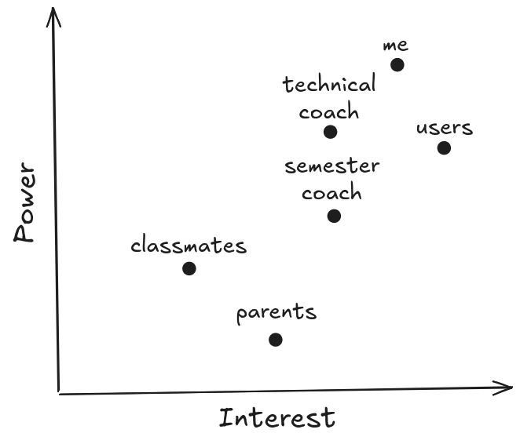

## Project Plan

**Student name**: Aleksandar Rangelov
**Student number**: 572 601

### Table of Contents

[TOC]

### 1. Introduction

The aim of the project is to create a solution for monitoring devices in local network environments. Software will collect system metrics from multiple devices and display them in a centralized user interface, enabling devices to be monitored remotely.

### 2. Objective

> The main objective is to create a lightweight and user-friendly monitoring system.

The system will:

- **Monitor in real-time**: Display live CPU, Memory, Disk, Network and Processes 
- **Minimize resource usage**: Lightweight scraping host with minimal system impact
- **Maximize user experience**: Intuitive user interface

### 3. Main question

> How to efficiently monitor multiple devices in real-time with minimal overhead?

### 4. MoSCoW method

#### 4.1 Must have

- Host collecting system metrics (CPU, memory, disk)
- WebSocket server for real-time data streaming
- Dashboard displaying live metrics

#### 4.2 Should have

- Connection status indicators
- Active hosts registry
- Host auto-registration to host registry

#### 4.3 Could have

- Basic authentication
- VPN connectivity
- Alert notifications
- Basic charts visualization
- Custom metric collection intervals
- Data export functionality
- Host management user interface

#### 4.4 Won't have

- Advanced authentication system
- Multiple user support
- Localization
- Historical data of system metrics

### 3. SWOT Analysis

#### 3.1 Strengths

- Real-time monitoring
- Minimal dependencies
- Cross-platform compatibility
- Low resource footprint
- Simple deployment

#### 3.2 Weaknesses

- Limited to local network (without VPN)
- Single-user design
- Basic information visualization
- Cannot control device remotely from dashboard

#### 3.3 Opportunities

- Add more metric types (file structure, docker containers)
- Implement alerting system
- Create mobile dashboard

#### 3.4 Threats

- Network connectivity issues
- WebSocket connection instability
- Data corruption
- Crashes

### 4. Stakeholders

#### 4.1 PI matrix

### 5. Planning

> Each estimation includes buffer time for unexpected issues, research and learning. 

#### 5.1 Analysis

| **Task**                    | **Estimated Time** |
| --------------------------- | -------------------------- |
| Collect requirements        | -                          |
| Research tools & frameworks | 2 h                         |
| Documentation               | 4 h                         |

#### 5.2 Design

| **Task**              | **Estimated Time** |
| --------------------- | -------------------------- |
| Design code structure | 1 h                         |
| Design host logic    | 5 h                         |
| Design client logic   | 3 h                         |
| Create wireframes     | 2 h                         |
| Documentation         | 4 h                         |

#### 5.3 Realisation

##### 5.3.1 Host Development

| **Task**                             | **Estimated Time** |
| ------------------------------------ | -------------------------- |
| Set up host project                 | 2 h                         |
| Implement metrics collection         | 6 h                         |
| Implement websocket server           | 5 h                         |
| Stream live metrics every 30 seconds | 2 h                         |
| Test websocket server with Postman   | 4 h                         |
| Refine implementation                | -                          |
| Test on local machine                | -                          |
| Fix bugs                             | -                          |
| Documentation                        | 5 h                         |

##### 5.3.2 Client Development

| **Task**                      | **Estimated Time** |
| :---------------------------- | -------------------------- |
| Set up client project         | 1 h                         |
| Set up web server             | 2 h                         |
| WebSocket connection to host | 3 h                         |
| Create HTML structure         | 3 h                         |
| Display live metrics          | 3 h                         |
| Handle reconnections          | 1 h                         |
| Connection status indicators  | 1 h                         |
| Basic styling and layout      | 2 h                         |
| Final polish                  | 1 h                         |
| Documentation                 | 5 h                         |

### 6. Learning Outcomes

#### 6.1 Technical Skills

- **WebSockets**: Understanding bidirectional real-time data streaming
- **Multi-Machine Architecture**: discovery, registration, health checks
- **Networking**: VPN, remote access
- **Real-Time Data**: Live updates, performance optimization

#### 6.2 Professional Skills

- **System Design**: Designing distributed monitoring architecture
- **Documentation**: Writing clear technical documentation
- **Time Management**: Delivering working product within a 4-week timeline

### 7. Conclusion

This project will result in a functional local network monitoring system while developing valuable skills in real-time communication, distributed systems, and networking. The 4-week timeline is aggressive but achievable with proper time management and the minimalist technology stack chosen. The system will serve as a foundational tool for ongoing systems management and can be extended with additional features in the future.
