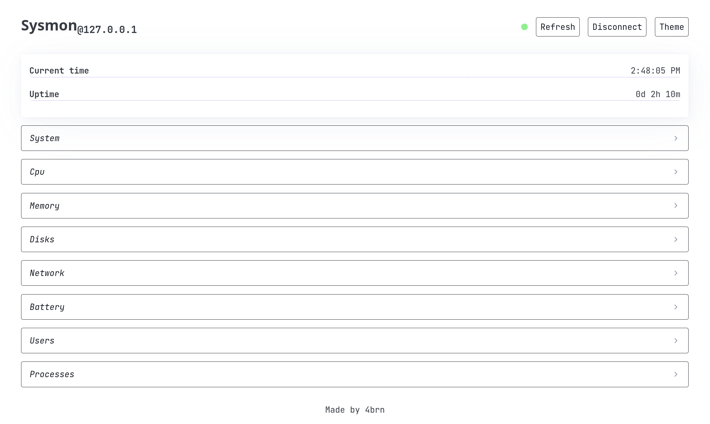
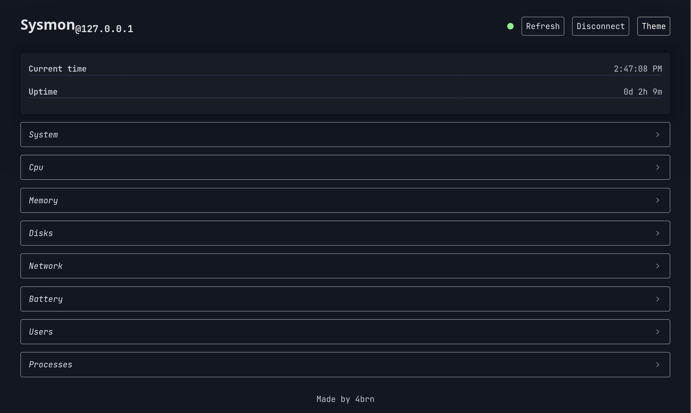
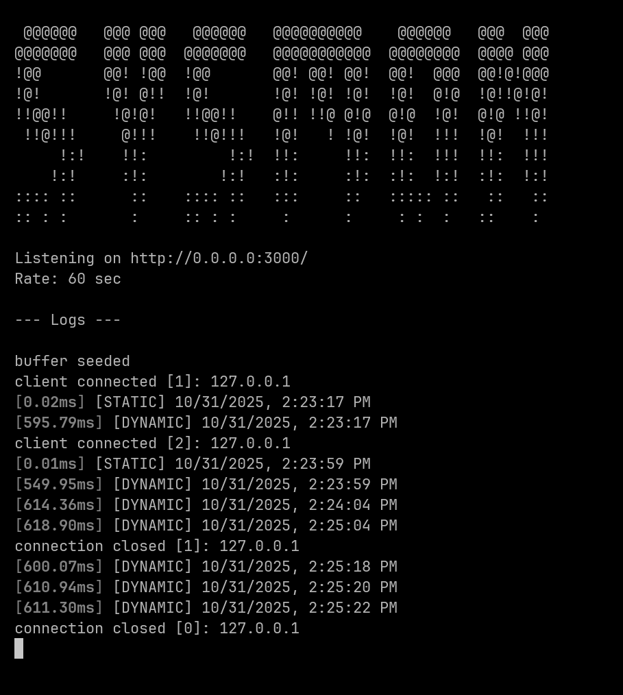

# Realisation

**Student Name:** Aleksandar Rangelov
**Student Number:** 572601


## Table of Contents

[TOC]

## 1. Introduction

This document describes the technical implementation of Sysmon - a real-time system monitoring platform. It covers the development environment setup, implementation approach, key code structures, and deployment procedures.

## 2. Development Environment

### 2.1 Required Software

| Software   | Version | Purpose                                |
| ---------- | ------- | -------------------------------------- |
| Bun        | 1.0+    | JavaScript runtime and package manager |
| TypeScript | 5.0+    | Type checking and compilation          |
| Git        | 2.0+    | Version control                        |

### 2.2 System Requirements

- Operating System: Windows, macOS or Linux
- Memory: 1GB minimum
- Network: Local network access for client connections
- Ports: 3000, 1337 

## 3. Realisation

> Due to the project being a local prototype, Host IP Storage is not implemented, therefore multiple devices are not supported.

### 3.1 Development Phases

#### 3.1.1 Project Setup

  - [x] Set up separated client and host project directories
  - [x] Set up package dependencies

#### 3.1.2 Host

- [x] Create WebSocket server
- [x] Integrate systeminformation library
- [x] Create data collection handler functions
- [x] Implement pub-sub

#### 3.1.3 Client

- [x] Create HTTP server
- [x] Set up route handling
- [x] Implement WebSocket connection to host
- [x] Create DOM element references
- [x] Create static and dynamic data rendering functions
- [x] Implement theme toggle functionality
- [x] Add loading state management
- [ ] Multiple host devices support

#### 3.1.4 Testing & Refinement

- [x] Cross-browser compatibility testing
- [x] Performance optimization

### 3.2 Realisation Decisions

**Data Buffering**

The separation of static and dynamic data suggests that some information changes less frequently. On host server startup, static and dynamic data is collected and cached in a serialized buffer. By buffering the data, redundant data collection is reduced.

**Direct DOM manipulation**

By keeping a refference to the exact DOM element that holds data, html structure is kept intact. Moreover, rendering costs and response times are decreased and deployment is easier, all for the downside of code being more verbose.

## 4. Architecture

### 4.1 Project Structure

```
sysmon/
├── docs/                     # Documentation
├── src/
│   ├── client/               # Client directory
│   │   ├── src/
│   │   │   ├── css/
│   │   │   │   ├── index.css      # Custom styles
│   │   │   │   └── pico.min.css   # CSS framework
│   │   │   ├── pages/
│   │   │   │   ├── index.html     # Main HTML page
│   │   │   │   └── script.js      # Frontend logic
│   │   │   └── server.ts          # HTTP server
│   │   └── package.json
│   ├── host/                 # Host directory
│   │   ├── src/
│   │   │   ├── data.ts            # Data collection logic
│   │   │   ├── server.ts          # WebSocket server
│   │   │   └── template.json      # What system metrics are collected
│   │   └── package.json
│   └── shared/               # Shared directory
│       └── types.d.ts             # Typescript types
└── README.md
```

#### 4.1.1 Host

**host/src/server.ts**

- Websocket server running on port 3000
- Handles client connection & subscriptions
- Broadcasts data to all subscribed clients

**host/src/data.ts**

- Integrates with systeminformation library
- Transforms raw system data into typed objects
- Separates static and dynamic data collection into separate functions

#### 4.1.2 Client

**client/src/server.ts**

- HTTP server running on port 1337
- Handles static files and api route handling 

**client/src/script.js**

- Establishes WebSocket connection with host
- Manages reconnection logic
- Renders received data to DOM
- Handles theme toggle

#### 4.1.3 Shared

**shared/types.d.ts**

- Defined types for all data
- Ensures type safety across the application
- Documents expected data structures

## 5. Code

### 5.1 Host WebSocket Server

**host/srs/server.ts**

```typescript
websocket: {
  async open(ws) {
    ws.subscribe("stream");
    clients++;
    
    // Send buffered static data immediately
    ws.send(buffer.static);
  },

  close(ws) {
    clients--;
  }
}
```

- Every connection is subscribed to "stream" data stream for efficient pub-sub broadcasting
- Static data sent immediately upon connection from pre-filled buffer
- Client counter tracks active connections for conditional scraping

### 5.2 Data Collection

**host/src/template.json**
```json
{
  "static": {
    "system": "model, manufacturer, virtual",
    "bios": "vendor, version",
    "osInfo": "platform, distro, kernel, arch, hostname",
    "cpu": "manufacturer, brand, physicalCores, cores",
    "mem": "total",
    "battery": "hasBattery",
    "diskLayout": "device, type, name, vendor, size",
    "wifiInterfaces": "iface, model, vendor, mac"
  },
  "dynamic": {...}
}
```
- Configures what information should systeminormation extract

**host/src/data.ts**

```typescript
import si from "systeminformation"

export async function getStaticData() {
  const data = await si.get(template.static); // collect data
  return {
    system: {
      model: data.system.model,
      vendor: data.system.manufacturer,
      virtual: data.system.virtual,
    },
    // ... other static properties
  } as StaticData;
}
```

- Collects only information defined in the `template.json` configuration file
- Maps systeminformation responses to custom semantic interface

### 5.3 Dynamic Data Broadcasting

```typescript
const scrapeInterval = setInterval(async () => {
  if (clients < 1) return;
  
  const data = JSON.stringify({
    type: "dynamic",
    data: await getDynamicData(),
  } as SysmonResponse);
  
  server.publish("stream", data);
}, delay);
```

- Data broadcasting in intervals
- Scrapes data only when clients are connected (optimization)
- Response is serialized before sending
- Publish-subscribe pattern for efficient multi-client delivery

### 5.4 DOM Reference Management

```javascript
const dom = {
  system: {
    model: document.getElementById("system.model"),
    vendor: document.getElementById("system.vendor"),
    virtual: document.getElementById("system.virtual"),
  },
  // ... other references
};
```

- Prefetch DOM references once on page load
- Organized by data category matching exact structure of received data
- Avoids repeated getElementById calls during updates

### 5.5 Data Rendering

```javascript
socket.onmessage = (event) => {
  const { type, data } = JSON.parse(event.data);
  switch (type) {
    case "static":
      renderStatic(data);
      break;
    case "dynamic":
      renderDynamic(data)2
      break;
  }
};
```
- Type of response is checked
- According data rendering handler is invoked

## 6. Deployment Guide

### 6.1 Installation

**Clone Repository:**

```bash
git clone https://github.com/4brn/sysmon
cd sysmon
```

**Install Dependencies:**

```bash
# Install host server dependencies
cd src/host
bun install

# Install client server dependencies
cd ../client
bun install
```

### 6.2 Development

**Terminal 1 - Start Host Server:**

```bash
cd src/host
bun start
```

**Terminal 2 - Start Client Server:**

```bash
cd src/client
bun start
```

- Open browser to `http://localhost:1337`

## 7. Screenshots

### 7.1 Dashboard

#### 7.1.1 Light Theme



#### 7.1.2 Dark Theme



#### 7.1.3 Fully Expanded


### 7.2 Host 

#### 7.2.1 Server Terminal Output



## 8. Conclusion

The implementation successfully delivers a functional prototype of a real-time monitoring system using a minimal technology stack. Key achievements include:

- Clean separation between data collection and visualization
- Efficient WebSocket communication with pub-sub pattern
- Type-safe code using TypeScript types
- Responsive UI
- Simple deployment

The codebase prioritizes maintainability through clear module boundaries. Future enhancements can be added without architectural changes due to the extensible design patterns employed.
