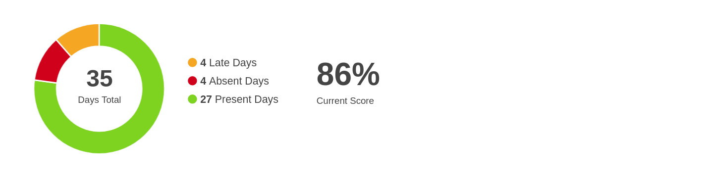

# Reflection

**Student Name:** Aleksandar Rangelov
**Student Number:** 572601

## Table of Contents

[TOC]

## 1. Introduction

> This document summarizes my experiences and learnings during the development of the project.

## 2. Learning Outcomes

### 2.1 Orientation

I chose to work on this project as it aligned with my interests and Software Engineering, Intelligent Devices and Networking courses provided by Fontys in the second semester.

### 2.2 Creating Professional IT Products

#### 2.2.1 Analysis & Advice

I researched tool made within this context of the project and saw the need for a lightweight, real-time system monitoring tool. I documented the requirements and quality criteria needed for the project and listed the use of technologies for the task.

#### 2.2.2 Design

I designed and documented every aspect of the project based on the requirements. The solution involved a client-server architecture using the WebSocket Protocol  for real-time data streaming.

#### 2.2.3 Realisation

I implemented the solution based on the design, paying attention to performance. The project was developed using Bun, TypeScript, and systeminformation library, ensuring a lightweight, efficient and easily deployable system.

#### 2.2.4 Validation

I tested the product, ensuring the implementation met the requirements, confirming the functionality and reliability of the project.

### 2.3 Professional Standards & Personal Leadership

#### 2.3.1 Attendance Rate

#### 2.3.2 FeedPulse

I actively asked for feedback from peers and coaches. Implemented recommendations and kept my professionalism during every interaction.

##### 2.3.2.1 Conversations with Semester Coach

I had regular conversations with my semester coach, discussing my progress and areas for improvement. This helped me stay on track and address any issues promptly.

##### 2.3.2.2 Conversations with Technical Coach

My technical coach provided valuable insights, helping me write better documentation.

## 3. Future Steps

- Improve time management skills.
- Seek more feedback from peers and coaches.
- Work on more complex projects to further develop my technical skills.

This reflection document summarizes my experiences and learnings during the semester, focusing on the development of the Sysmon project and my personal goals and future.